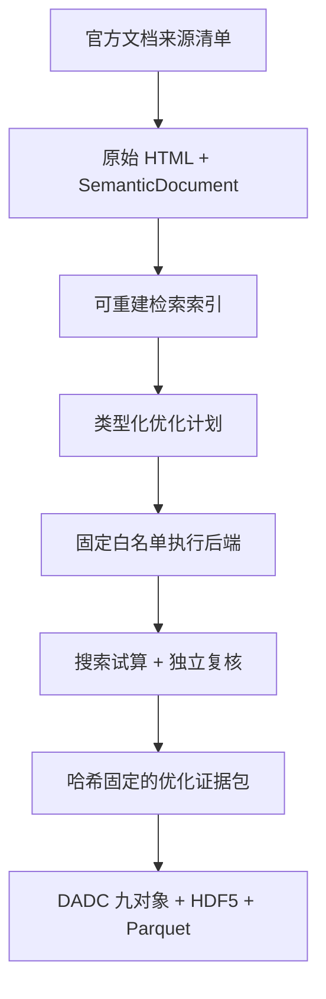

# 文档知识—受控求解—自动调优—DADC 入库最小闭环

这个闭环保留 DADC V1.0 的九个冻结实体，不把网页、向量或聊天记录伪装成 `Device`、`Run` 或 `Metric`。科研事实仍以 DADC JSON、HDF5、原生文件和 SHA-256 为准；文档语料及其搜索索引是独立、版本化且可重建的知识投影。



## 三条契约边界

| 契约 | 权威内容 | 可替换部分 | 禁止事项 |
|---|---|---|---|
| `knowledge_source_manifest v1` | URL、产品版本、抓取时间、许可说明、原始字节哈希、章节定位 | HTML 解析器、Embedding | 向量库作为唯一事实源；无版本网页混入 |
| `simulation_job v1` | 参数名/值/单位、目标、后端类型、试算类型 | `analytic_fixture`、`pyaedt_patch`、后续新后端 | LLM 生成任意代码后直接执行；`shell=True` |
| `optimization_bundle v1` | 预算、每次调用、结果、独立复核、伴随文件 SHA-256 | 搜索算法、物理领域适配器 | 最优点参与二次挑选；丢弃失败调用；夹具冒充物理结果 |

## 离线最小验收

下面的命令不需要 AEDT。解析夹具只证明接口、预算、追溯、篡改隔离和扩展点，不证明任何 HFSS 物理结论。

```powershell
& ".\.venv\Scripts\python.exe" "scripts\run_minimal_extensible_validation.py" `
  --output-dir "F:\DADC_DATA\mvp_validation_001"
```

也可以逐步执行：

```powershell
python -m dadc knowledge-collect `
  "examples\knowledge\local_fixture_sources.json" `
  "F:\DADC_DATA\mvp\knowledge"

python -m dadc knowledge-index "F:\DADC_DATA\mvp\knowledge"
python -m dadc knowledge-search "F:\DADC_DATA\mvp\knowledge" "Hfss create_setup frequency sweep"

python -m dadc optimize `
  "examples\automation\analytic_fixture_plan.json" `
  "F:\DADC_DATA\mvp\optimization"

python -m dadc init-warehouse "F:\DADC_DATA\mvp\data"
python -m dadc ingest `
  "F:\DADC_DATA\mvp\optimization\optimization_bundle.json" `
  --warehouse "F:\DADC_DATA\mvp\data\warehouse"
```

## 抓取官方 PyAEDT 最小语料

`examples/knowledge/pyaedt_official_sources.json` 只列出三个明确允许的官方页面；收集器会限制主机、单页字节数、超时和重定向目标。每次正式构建都应更新 `retrieved_at` 和 `product_version`，然后把完整 corpus 当作版本化文档快照保存。

```powershell
python -m dadc knowledge-collect `
  "examples\knowledge\pyaedt_official_sources.json" `
  "F:\DADC_DATA\knowledge\pyaedt_2026_08_21"

python -m dadc knowledge-index "F:\DADC_DATA\knowledge\pyaedt_2026_08_21"
```

## 在真实 Windows + AEDT 上自动调优

`pyaedt_patch` 不执行模型生成的任意脚本。它只调用仓库固定的 `generate_patch_antenna.py`，并只接受 `patch_length_mm`、`patch_width_mm`、`probe_relative_x_offset` 三个参数。每次试算使用独立目录，保留 request、stdout/stderr、`.aedt`、`.s1p` 和可获得的收敛/网格文件；适配器会重新解析全频带 S1P 并复算目标值。

```powershell
python -m pip install -e ".[aedt]"

python -m dadc optimize `
  "examples\automation\pyaedt_patch_plan.json" `
  "F:\DADC_DATA\inbox\pyaedt_patch_tuning_001"

python -m dadc ingest `
  "F:\DADC_DATA\inbox\pyaedt_patch_tuning_001\optimization_bundle.json" `
  --warehouse "F:\DADC_DATA\warehouse"
```

真实运行前必须人工核对变量范围、目标频率、AEDT/PyAEDT 版本、许可证、核数和输出目录。闭环会做最优点的独立全带复核，但网格独立性、跨求解器比较和实验符合性仍需额外 Validation 证据，不能由一次自动搜索替代。

## 下一步扩展规则

- 新文档格式：新增解析器和契约测试，原始字节与定位契约不变。
- 新求解器：实现 `SimulationBackend`，声明 `is_physical_solver` 和证据等级，不改调优器。
- 新优化算法：消费同一 plan/job/result 契约，继续记录预算并保留独立复核。
- 新器件/领域：新增 profile 或 domain package；不修改九个一级实体，不创建万能横表。
- LLM/Agent：只负责检索、计划和有证据综合；导入、执行、校验、索引仍走确定性工具与审批门禁。
